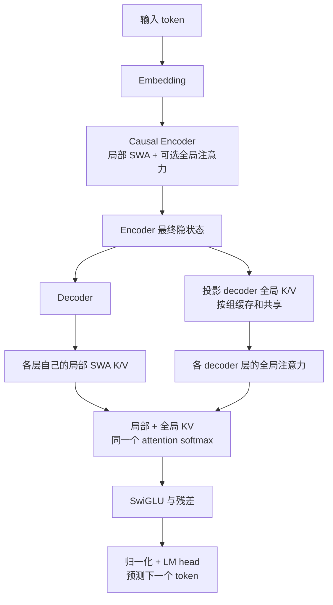

# CED：论文与实现对应

## 一手资料

本次依据 DeepSeek 官方 Hugging Face 仓库核对，固定 revision 为 `dba1be0a40aa45a94ad051997016db3960a90277`。

1. [DeepSeek-V4.1-Flash: Pushing the Limits of KV Cache Compression](https://huggingface.co/deepseek-ai/DeepSeek-V4.1-Flash/blob/dba1be0a40aa45a94ad051997016db3960a90277/DeepSeek_V41_Tech_Report.pdf)：§2.2 CED、§2.3 CSA2、§3.2.2 SWA Bounded Replay。
2. [官方模型说明](https://huggingface.co/deepseek-ai/DeepSeek-V4.1-Flash/blob/dba1be0a40aa45a94ad051997016db3960a90277/README.md)。
3. [官方推理 model.py](https://huggingface.co/deepseek-ai/DeepSeek-V4.1-Flash/blob/dba1be0a40aa45a94ad051997016db3960a90277/inference/model.py) 和 [推理配置](https://huggingface.co/deepseek-ai/DeepSeek-V4.1-Flash/blob/dba1be0a40aa45a94ad051997016db3960a90277/inference/config.json)。
4. CED 明确引用的前序工作：[You Only Cache Once: Decoder-Decoder Architectures for Language Models，YOCO，2024](https://arxiv.org/abs/2405.05254)，以及 [Microsoft 官方 YOCO 实现](https://github.com/microsoft/unilm/tree/master/YOCO)。

官方 V4.1 推理示例包含量化内核、多卡和完整大模型的其他组件，其 `Transformer.forward` 也仍按所有层执行。本项目从论文的数据依赖关系独立实现可反向传播的小型版本，并提供显式的 decoder bounded replay 路径；没有复制或转换官方权重。

## CED 的关键数据依赖

论文将 40 层分成 20 层 causal encoder 和 20 层 decoder。对 decoder 层 `l`，全局 KV 及压缩权重由 encoder 最后一层输出产生：

```text
C_l = H_encoder_final W_l^KV
Z_l = H_encoder_final W_l^Z
```

`C` 是潜在 KV，`Z` 用于压缩。SWA 的 KV 则始终来自各层自身的输入状态。结合 CSA2 后，全局 KV 可以按层组共享；官方配置的 decoder 全局 KV 源在第 20 层（从 0 开始编号）。



这里的 encoder 也使用因果注意力。训练时，位置 `t` 的 encoder 和 decoder 都只能访问 `≤ t` 的位置，而 logits 的目标是 `x[t+1]`。即使全局 KV 来自 encoder，decoder 也必须应用因果遮罩：未来 encoder 状态包含未来输入，直接读取就会泄漏标签。

本项目使用普通 GQA 的独立 K/V 投影来表达该数据流：

```text
M = CausalEncoder(Embedding(x))
K_global[g], V_global[g] = Project_g(RMSNorm(M))
Q_l, K_local_l, V_local_l = Project_l(RMSNorm(H_l))
H_(l+1) = Block_l(H_l, local_KV_l, global_KV[group(l)])
```

decoder 从 `M` 开始计算。每层把局部与全局 KV 拼接后做一次注意力，保留两路 KV 的不同投影。同一个 token 可以同时作为局部和全局条目参与注意力。

## 与 YOCO 的联系

YOCO 的下半部分 self-decoder 生成全局 KV，上半部分 cross-decoder 共享它们，并支持保持输出等价的 prefill early exit。

CED 在 decoder 中继续保留每层自己的 SWA，因此 decoder 的层间局部依赖会逐层累积。跳过大部分 decoder prompt 计算时，仅有全局 KV 还不够，还要重建 decoder 的局部状态。这是 bounded replay 出现的原因。

## Exact 与 bounded replay

`prefill(mode="exact")`：

1. Encoder 完整处理 `N` 个 prompt token。
2. 从 encoder 输出建立 decoder 全局 KV。
3. Decoder 完整处理 `N` 个 token。
4. 返回最后位置 logits、全局缓存，以及各层最后 `W` 个局部 KV。

后续 `decode()` 追加单个 token 或连续 chunk。它的 logits 与完整前向在浮点误差范围内一致。

`prefill(mode="bounded")`：

1. Encoder 与全局 KV 仍覆盖整个 prompt。
2. Decoder 仅处理最后 `min(N, W)` 个 token，保留这些 token 的绝对位置。
3. 全局注意力可看见全部因果前缀；局部注意力的下界为 `max(replay_start, t-W+1)`。
4. 后续 token 从这份近似缓存继续计算。

多个 decoder 层会累积局部依赖，只回放一个窗口无法重建全部历史依赖。因此 **bounded 模式与 exact 模式不保证数学等价**。`cache.approximate` 显式记录是否发生过截断回放，短于窗口的 prompt 则仍然精确。论文还介绍 encoder SWA 缓存丢失后的回放；这个版本没有实现那条跨请求持久化路径。

论文报告的近半 prefill 成本来自完整架构与专门部署。本实现用稠密 attention 表达语义，训练阶段还要经过两组网络。它没有论文级长上下文吞吐保证：完整注意力与遮罩仍有 `O(N²)` 成本，global cache 追加使用 `torch.cat`，主要用于小规模研究和验证。

## 复现范围

| 机制 | 当前实现 |
| --- | --- |
| Causal encoder → decoder | 保留；默认 2+2 或 3+3 层 |
| Decoder 全局 KV 由 encoder 末层生成 | 保留，`EncoderMemory` 负责 |
| 每层独立局部 SWA KV | 保留，缓存大小受窗口限制 |
| Decoder 跨层共享全局 KV | 保留，可按 `decoder_kv_groups` 分组 |
| Decoder bounded replay | 保留，显式近似、默认关闭 |
| RMSNorm / RoPE / SwiGLU | 保留标准实现 |
| 潜在 KV 与压缩 | 简化为普通 GQA K/V，无序列压缩 |
| CSA2 Full / Reindex / Reuse、层次稀疏索引 | 未实现；共享 KV 这一点不足以称为完整 CSA2 |
| MoE / Engram / Single-Pass mHC | 用稠密 FFN 和普通残差替代 |
| FP4 / FP8 缓存、自定义内核 | 使用 PyTorch 浮点计算与 SDPA |
| 视觉、DSpark、百万上下文、官方 checkpoint 兼容 | 不在当前版本范围内 |
| Encoder SWA 回放与持久化 prefix cache | 未实现 |

该范围让实验首先检验 CED 的结构和训练可行性。扩展稀疏索引、MoE 或压缩时，可以分别替换注意力和 FFN，而不改变 encoder 到 decoder 的全局 KV 数据流。

## 代码约定

模型接口接收非空的 `[batch, time]`、`torch.long` token；同一个 batch 内序列等长。`forward(x, y)` 的 `y` 已由数据层向后移动一位。调用缓存接口前使用 `model.eval()`；缓存属于生成它的模型与当前序列，不跨训练更新复用。

自定义配置需保证 `d_model / n_heads` 是偶数，`n_heads` 可被 `n_kv_heads` 整除，decoder 层数可被 KV 组数整除，SWA-only 层数在 encoder 层数范围内。内置配置和测试遵循这些约定。
